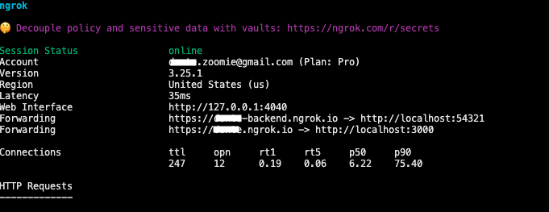

# Zoom Apps SDK Next.js sample app

## Overview

This repository contains a sample Zoom app built with Next.js using the Zoom Apps SDK.

**Key features:**

* **Next.js frontend**: A boilerplate web application for buiding Zoom apps.  

## Prerequisites

* **Node.js ≥ 20.6.0** (for built-in `--env-file` support). If using an older version, install `dotenv`.
* **pnpm** (for workspace management)
* Zoom credentials (Client ID, Client Secret)
* Supabase account

## Set up the project

1. **Clone the repository and install dependencies**:

   ```bash
   git clone https://github.com/just-zoomit/zoomapps-nextjs-sample.git
   cd zoomapps-nextjs-sample
   npm install
   ```

## Run the app locally

1. **Start both services from the root directory**:

   ```bash
   npm run dev
   ```

   * The frontend (Next.js) will be available at `http://localhost:3000`.

## Start multiple ngrok endpoints

To run multiple ngrok connections using a configuration file:

```bash
ngrok start nextjs supabase
```

You should the tunnel traffic: 




| Endpoint name | Public URL                 | Upstream port | Use case / purpose                                                                                 |
| ------------- | -------------------------- | ------------- | -------------------------------------------------------------------------------------------------- |
| `nextjs`      | `example.ngrok.io`         | 3000          | Serves the Next.js frontend (SSR/SSG pages, React components, dashboard UI, authentication flows). |
| `supabase`    | `example-backend.ngrok.io` | 54321         | Runs the Supabase backend (Postgres database, GoTrue auth, storage, and edge functions).           |

## Start Supabase locally

1. Navigate to the frontend project directory. Each local Supabase project is scoped to its directory. Then run:

   ```bash
   supabase start
   ```

   This starts the Supabase stack for the current project.

   * Studio will be available at: `http://localhost:54323`
   * The running project will reflect the configuration in `config.toml` for that directory.

2. **Verify the containers are running**:

   After starting Supabase, you should see output similar to:

   ```bash
   Started supabase local development setup.
   Studio URL: http://localhost:54323
   API URL: http://localhost:54321
   Check that the containers are running:
   ```

   Confirm by checking:

   ```bash
   docker ps
   ```

   You should see containers such as `supabase-studio`, `supabase-auth`, and `supabase-db`.


  
## Additional resources

* [App manifest](./AppManifest.md)

## License

This project is licensed under the MIT License. See the [LICENSE](https://github.com/zoom/rtms-nextjs/tree/main?tab=License-1-ov-file) file for details.

